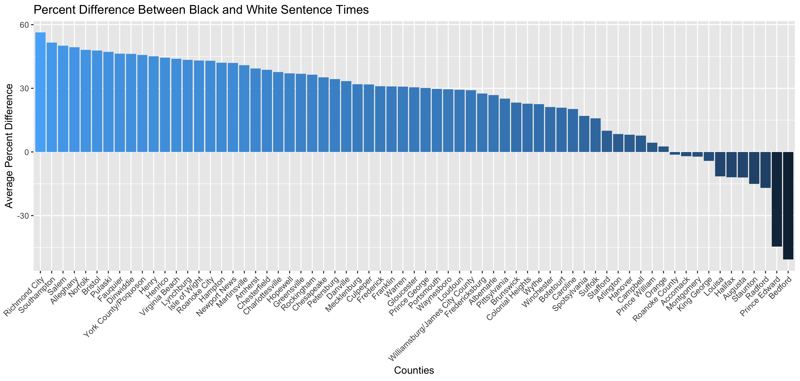

# Data Analysis Project Memo

## Primary Findings

In many Virginia counties, black people are spending more time in prison than white people for committing the same crimes. This analysis is the first of its kind in Virginia, but the findings are consistent with other recent nation- and state-wide analyses (see [below](#issue-in-context)).

Across Virginia from 2007-2017, black people were sentenced to about a half year longer in prison than white people, an average of 25 percent more time. That's 6 percent more than the national average as reported in 2017 by the U.S. Sentencing Commission.

But in individual counties, the difference was sometimes much greater.

Fifty-six of the 67 counties studied showed black people serving longer sentences than white. Southhampton was one of the worst offenders, with black people spending an average of 1.5 years longer behind bars, 52 percent more time than white people.

Of the remaining 11 counties, the greatest swing in the other direction — where white people spent longer in prison than black — was in Bedford, a 51 percent difference or about one year.

Finally, the five most populous counties — each at more than 10,000 people — all showed sentence disparities in which black people served longer sentence times than white people. Percent difference:
* Richmond: 56 
* Norfolk: 48 
* Henrico: 44 
* Chesterfield: 39
* Chesapeake: 35

## Issue in Context

### U.S. Sentencing Commission Nationwide Report, 2017
The U.S. Sentencing Commission — an independent commission within the Department of Justice — released in 2017 a [report](https://www.ussc.gov/research/research-reports/demographic-differences-sentencing) on nationwide sentencing disparities, finding a  difference of about 19 percent between black and white men. This analysis controlled for a variety of factors, including age, citizenship, gender and prior criminal history.

Many news outlets, including [The Washington Post](https://www.washingtonpost.com/news/wonk/wp/2017/11/16/black-men-sentenced-to-more-time-for-committing-the-exact-same-crime-as-a-white-person-study-finds/?utm_term=.6a14b98857e9) and [Vox News](https://www.vox.com/identities/2017/11/17/16668770/us-sentencing-commission-race-booker), published analyses of this report, illuminating background factors such as the role of prosecutors in choosing which charges to pursue. They also performed time-series analyses to examine how changes to sentencing laws may have affected sentences.

### Herald Tribune Florida Overview, 2016
The Herald Tribune completed in December 2016 an exhaustive analysis of racial disparities in sentencing [across Florida](http://projects.heraldtribune.com/bias/sentencing/). From the article: 

>Reporters examined more than 85,000 criminal appeals, read through boxes of court documents and crossed the state to interview more than 100 legal experts, advocates and criminal defendants.
>
>The newspaper also built a first-of-its-kind database of Florida’s criminal judges to compare sentencing patterns based on everything from a judge's age and previous work experience to race and political affiliation.

This analysis looked specifically at sentence disparities across types of crimes both across the state and in individual counties. Florida courts use a point system, so the Herald analysis was able to take into account not only similar charges but similar point values assigned to defendants, as well. 

Their findings:
>[Trial judges] offer blacks fewer chances to avoid jail or scrub away felonies.
>
>They give blacks more time behind bars — sometimes double the sentences of whites accused of the same crimes under identical circumstances.

The article begins by laying out its general findings, which are numerous, then presents anecdotes exemplifying those findings. Bar charts illustrate each finding. It also places the issue in context by exploring historic racial tensions. Finally, it presents an overview of existing checks and oversight of sentencing practices (of which there is little) and the racial makeup of the court system (which is overwhelmingly white).

### Academic Research
- [Examining Sentencing Disparity in Virginia: The Impact of Race and Sex on Mitigating Departures for Drug Offenders](https://www.emeraldinsight.com/doi/abs/10.1108/S1521-613620170000022010), Sociology of Crime, Law and Deviance, Volume 22, Emerald Publishing Limited; 2017

## Strengths and Limitations of Analysis
### Scope
My analysis looked at sentence times for black and white people found guilty of a crime, adjusted for sentence suspensions from 2007 to 2017. It only considered counties with at least 1,000 of such cases and a 25 percent minimum percentage of cases in each of the two racial categories.

### Strengths
Because the data set is not a sample of cases but rather every case, statistical variance is not an issue. Additionally, because I only analyzed counties with a given threshold of total and black/white cases, I limited the effect of outlier cases on the overall results. 

In order to understand each case holistically, I grouped charges based on defendant name, location, year filed and race. This should allow a more truthful understanding of sentencing times per case, as opposed to looking at each charge individually. 

### Weaknesses
The analysis only uses high numbers of cases to limit the effect of outlier cases. A more thorough analysis would look more closely into each county to identify and understand potential outlier cases and their effect on the results.

The aggregation did not take into account birthdays or dates of offense, so this grouping may need further adjustment to ensure unrelated cases are not grouped together. 

This analysis did not control for the same variables as the USSC report. Some, such as age and criminal history, are not included in the data I analyzed.

Particularly problematic is a lack of a systematic analysis of crime types, though I did spot check the crimes to get a feel for the types of crimes. A more complete analysis would look more like that of the Herald Tribune, which examined crime types across the state and within individual localities. Unfortunately, the fields holding crime types are extremely messy and will require many hours of cleaning before these data are usable. 

The underlying data set analyzed did not include some counties, most notably Fairfax County, which has a population of more than 1 million people.

Finally, the R code is messy and difficult to reproduce. This is a result of learning and applying the language on the fly. Since an important part of this analysis was finishing it on deadline, clean code was not my priority; but I could and should clean it up given the time. 

## Narrative Example
The most effective examples would be to find paired cases, one black and one white, for which the charges are the same but the sentence is greater for the black than the white person. Drilling into the data this way will be more effective once the charge data are cleaned and more controls are in place as mentioned above, but as it stands I found the following illustrative case:

### Heroin Possession in Richmond, 2017
Two white defendants and one black were charged with and found guilty of a single count of possession of heroin and nothing else in Richmond in 2017. None of the cases resulted in an amended charge, and all were decided by a guilty plea. 

All three defendants received a sentence of five years, but both white defendants had their sentences suspended by the full amount, while the black defendant had to serve about three months in prison.

## Next Steps
### Verification and Fairness
- Compare against the Emerald journal's findings
- Speak with county clerks to ensure proper understanding of crime codes and crime descriptions, as needed
- Interview county prosecutors, judges, legal experts and county clerks to allow them to respond to my findings and provide alternate explanations besides racial bias
- Take special care to ensure any anecdotes account for outstanding factors such as criminal history

### Code Adjustments
- Clean up existing R code for better utility and reproducibility
- Tweak aggregation to add birthday, sex and offense date as differentiating factors

### Further Reporting and Analysis
- Dive deeper into each county to look for outlier cases that may be skewing results
- Clean crime type fields and re-agregate for analysis
- More deeply analyze the Emerald journal's findings and the report from USSC (file FOIA for underlying data)
- Discuss methodology with Herald reporters
- Compare rates of sentencing with census data on racial demographics for deeper context within counties
- Find especially interesting cases to use as anecdotes, then look more deeply into them and interview relevant parties (defendants, judges, prosecutors, etc.), preferably on location to be able to add descriptors of the areas in question
- Examine how the disparity has changed over time statewide and in specific counties

